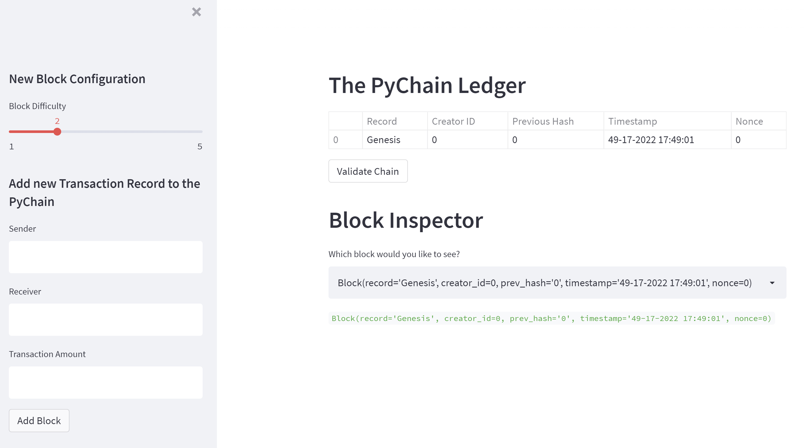

# Blockchain Ledger with Web interface on Streamlit

The main purpose of this project is to build a blockchain-based ledger system, complete with a user-friendly web interface.

---

## Technologies

1. [**Streamlit**](https://streamlit.io/) is an open-source Python library that makes it easy to create and share beautiful, custom web apps

2. [**Dataclasses**](https://docs.python.org/3/library/dataclasses.html) are classes used for storing data. **DataClasses** provides a decorator and functions for automatically adding generated special methods to user-defined classes.

3. [**Hashlib**](https://docs.python.org/3/library/hashlib.html) is a secure hash and message digest algorithm library.

4. [**Pandas**](https://pandas.pydata.org/) is a fast, powerful, flexible and easy to use open source data analysis and manipulation tool, built on top of the Python programming language.

---

## Installation Guide

Before running the application first install the following dependencies (some of them can already be installed for your environment).

```python
  pip install streamlit
```

---

## Usage

To use PyChain Ledger simply clone the repository, go to the repository folder and run the following command in your terminal:

```
  streamlit run pychain.py
```
After this step new tab will be opened in your default web-browser automatically. If not, follow the instractions generated by Streamlit in the terminal and open the page using the provided address manually. 

After the page is opned in web-browser you will see the following user interface:


On the left side (in sidebar) you can configure the level of difficulty needed to generate a new block, plus you can add a new block to the PyChain Ledger specifying transaction details in the corresponding fields.

On the right side you can review PyChain Ledger with all added blocks, you can validate your PyChain Ledger and you can inspect any block by selecting it in the dropdown field with the block info. 

---

## Contributors

Brought to you by [Kirill Panov](https://www.linkedin.com/in/kirill-panov-696455192/) (us.kirpa1986@gmail.com).

---

