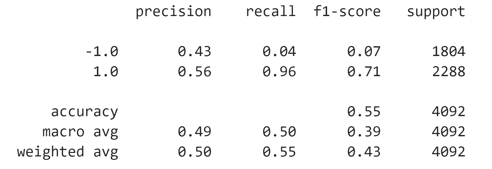
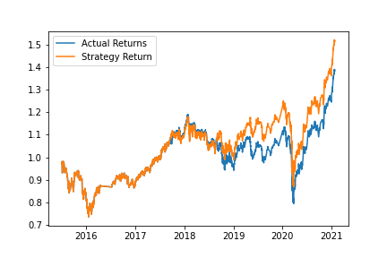

# ML Trading Bot

This project aims to anayze the trading strategy based on different ML classifying models and to create an algorithmic trading bot that learns and adapts to new data and evolving markets. 


---


## Technologies

This analysis is prepared in Jupyter Notebook using python 3.8 and the rich features of the [**pandas library**](https://pandas.pydata.org/) to perform the data analysis. 

[**scikit-learn**](https://scikit-learn.org/stable/index.html) that is open source library with a huge number of simple and efficient tools for predictive data analysis. The scikit-learn library categorizes the machine learning models into different groups, which it calls modules.Each group of functions implements different machine learning techniques. 


---
## Installation Guide

Before running the application first install the following dependencies (some of them can already be installed for your environment).

```python
conda install scikit-learn (it will also install all required dependencies)

```

---

## Outcomes

This analysis uses several models to predict trading ourcomes and identify the best one:
1. Baseline model - **SVC classifier** from **Support Vector Machine (SVM)** learning method with 3 months as an offset. The parameters for the baseline model are the following:

    * Training data - 3 momths
    * Window for Fast SMA - 4
    * Window for Long SMA - 100

    Classification report for the baseline model:
    

    Strategy returns vs. Actual returns plot for baseline model:
    

2. Alternative Baseline model (SVC) 1 - baseline model adjusted with the following parameters:

    * Training data - 6 momths
    * Window for Fast SMA - 4
    * Window for Long SMA - 100

    Classification report for the Alternative Baseline model 1:
    _report.png)
    Strategy returns vs. Actual returns plot for Alternative baseline model 1:
    _plot.png)


3. Alternative Baseline model (SVC) 2 - baseline model adjusted with the following parameters:

    * Training data - 3 momths
    * Window for Fast SMA - 20
    * Window for Long SMA - 200

    Classification report for the Alternative Baseline model 2:
    _report.png)
    Strategy returns vs. Actual returns plot for Alternative baseline model 2:
    _plot.png)

4. Alternative model 3 - built with **LogisticRegression** classifier 

    * Training data - 3 momths
    * Window for Fast SMA - 20
    * Window for Long SMA - 200

    Classification report for the Alternative Baseline model 3:
    _report.png)
    Strategy returns vs. Actual returns plot for Alternative baseline model 2:
    _plot.png)


5. Alternative model 4 - built with **DecisionTreeClassifier**

    * Training data - 3 momths
    * Window for Fast SMA - 20
    * Window for Long SMA - 200

    Classification report for the Alternative Baseline model 3:
    _report.png)
    Strategy returns vs. Actual returns plot for Alternative baseline model 2:
    _plot.png)


**Results:**

Classification report and plots above show that the Baseline SVM model and Alternative Baseline model 1 (with increased size of the training dataset) made trading decisions that outperformed the actual returns in some market scenarios, as illustrated by the steep rise in the *trading_algorithm_returns* plot line.

Alternative Baseline Model 2 (with changed SMA window sizes) made training decisions that mostly underperformed the actual results. 

Two other models that were built using LogisticRegression and DecisionTreeClassifier don't show any improvements compared with the Baseline Model. 


---
## Usage

To use the project simply clone the repository and open the **machine_learning_trading_bot.ipynb** file in Jupyter Notebook. 


## Contributors

Brought to you by [Kirill Panov](https://www.linkedin.com/in/kirill-panov-696455192/) (us.kirpa1986@gmail.com).

---

