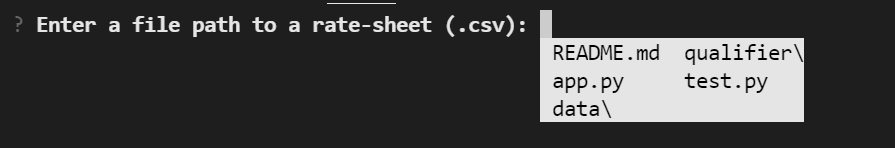

# Loan Qualifier

**Loan Quaifier** project provides users with a functionality to estimate if they are qualify for loan from a number of lenders (banks or lending companies) based on user's financial figures and calculated ratios:
* **Loan**: the amount of money that you want to request from a lender 
* **[Credit Score](https://www.investopedia.com/terms/c/credit_score.asp)**: a number that represents creditworthiness based on credit history.
* **[Gross monthly income](https://www.investopedia.com/terms/g/grossincome.asp)**: all the monthly income that you earn before taxes.
* **[Debt-to-income (DTI) ratio](https://www.investopedia.com/terms/d/dti.asp)**: a comparison of how much you owe to how much you earn per month.
* **[Loan-to-value (LTV) ratio]()**: this ratio compares the amount of the loan that you're asking for to the appraised value of the item that you want to buy.

---

## Technologies

This project leverages python 3.8 with the following packages:

* [fire](https://github.com/google/python-fire) - For the command line interface, help page, and entry-point.

* [questionary](https://github.com/tmbo/questionary) - For interactive user prompts and dialogs

> If you use VS Code please make sure you pick the right Python interpreter (global or virtual environment) based on where these packages were installed.

---
## Installation Guide

Before running the application first install the following dependencies.

```python
  pip install fire
  pip install questionary
```

---

## Usage

To use the Loan Qualifier project simply clone the repository and run the **app.py** file

```python
python app.py
```

Upon launching the loan qualifier you will be greeted with a prompt to enter a path to a csv file with available loans from different lenders:


---

## Contributors

Brought to you by [Kirill Panov](https://www.linkedin.com/in/kirill-panov-696455192/) (us.kirpa1986@gmail.com).

---

## License

MIT License