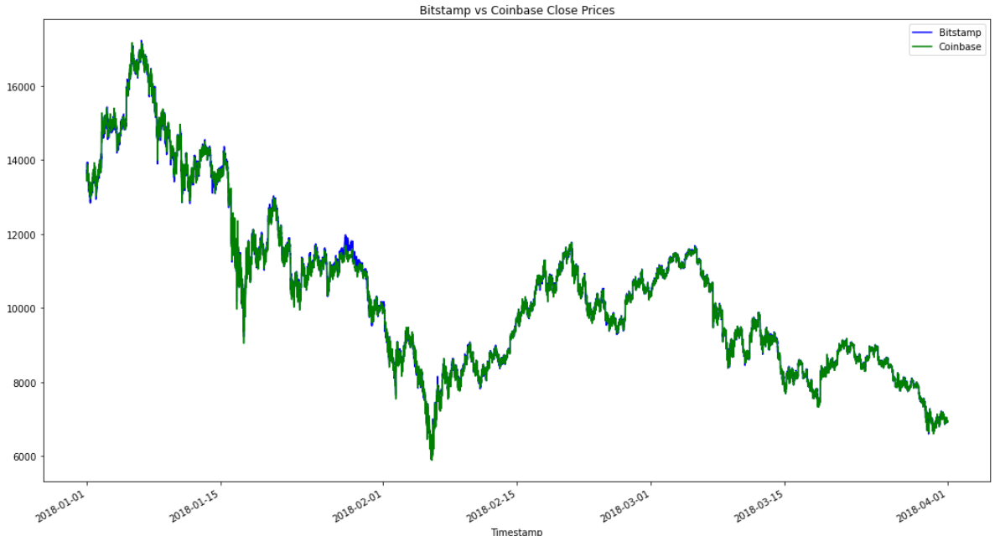
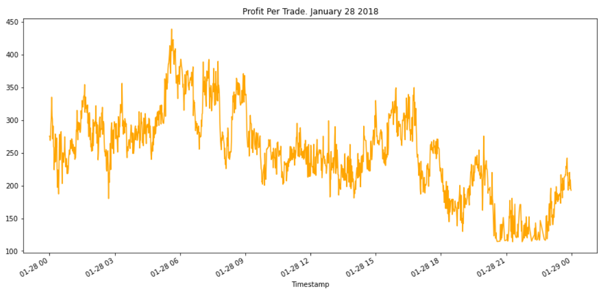

# Arbitrage Opportunities for Bitcoin. January - April 2018

This analysis shows the arbitrage opportunities for Bitcoin in early 2018 based on the data from two exchenges - Bitstamp and Coinbase. 

**Arbitrage** is the almost-simultaneous purchase and sale of an asset to profit from a difference in the asset's price between markets/exchanges.

---
## Analysis outcomes
The results of this analysis shows that there were a pretty significant arbitrage opportunities in January 2018 with a sizable spread spike on January 28 2018. Also data analysis and visualisations show that after that spike the arbitrage opportunities significantly decreased reducing the possible profit to 0 in February - April. 

---

## Technologies

This analysis is prepared in Jupyter Notebook using python 3.8 and the rich features of the **pandas** library to perform the data analysis.

---

## Contributors

Brought to you by [Kirill Panov](https://www.linkedin.com/in/kirill-panov-696455192/) (us.kirpa1986@gmail.com).

---

## License

For internal usage